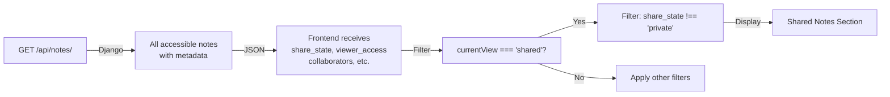

# FastAPI Collaborators - Quick Reference Guide

## 📌 Folder Structure at a Glance

```
backend/fastapi_app/
├── app.py                          → Main FastAPI application
├── routers/collaborators.py        → All 6 endpoints
├── schemas/collaborators.py        → Request/Response models
├── utils/auth.py                   → JWT verification
└── ARCHITECTURE.md                 → Detailed docs
```

## 🔗 Endpoint Summary

| Method | Path | Owner Only? | Purpose |
|--------|------|------------|---------|
| GET | `/api/notes/{note_id}/collaborators/` | ✓ | List collaborators |
| POST | `/api/notes/{note_id}/collaborators/` | ✓ | Add collaborator |
| PATCH | `/api/notes/{note_id}/collaborators/{user_id}/` | ✓ | Update access level |
| DELETE | `/api/notes/{note_id}/collaborators/{user_id}/` | ✓ | Remove collaborator |
| GET | `/api/invitations/` | - | List pending invitations |
| POST | `/api/invitations/` | - | Accept/Decline invitation |

## 🎯 Shared Notes Logic (NO DEDICATED ENDPOINT)

**Shared notes are NOT fetched via a separate API call.**

Instead:
1. Backend sends **ALL** accessible notes via `GET /api/notes/`
2. Each note includes metadata: `share_state`, `viewer_access`, `collaborators`
3. Frontend filters based on `currentView`:
   - **"shared"**: `share_state !== 'private'`
   - **"notes"**: `viewer_access === 'owner' && share_state === 'private'`
   - etc.

### Fields Used for Shared Notes Display

```python
# NoteSerializer provides these fields:
{
  "id": 1,
  "title": "Note Title",
  "share_state": "shared",        # "shared", "private", or "pending"
  "viewer_access": "view",        # "owner", "view", "edit", "pending"
  "collaborators": [              # Only active collaborators
    {"id": 2, "name": "User B", "email": "b@example.com", "access_level": "view"}
  ],
  "is_archived": false,
  "is_deleted": false,
  ...
}
```

## 🔐 Authentication Pattern

All endpoints require:
```
Authorization: Bearer <JWT_TOKEN>
```

Utils function: `verify_auth_header(authorization: str) -> User`

## 📦 Key Classes & Functions

### In `routers/collaborators.py`:

```python
# These functions correspond to the 6 endpoints:
async def list_collaborators(note_id: int, authorization: str)
async def add_collaborator(note_id: int, data: CollaboratorAddSchema, authorization: str)
async def update_collaborator(note_id: int, user_id: int, data: CollaboratorAddSchema, authorization: str)
async def remove_collaborator(note_id: int, user_id: int, authorization: str)
async def list_pending_invitations(authorization: str)
async def respond_to_invitation(data: InvitationActionSchema, authorization: str)
```

### In `utils/auth.py`:

```python
verify_auth_header(authorization: str) -> User  # Main function to use
get_bearer_token(auth_header: str) -> Optional[str]
decode_token(token: str) -> dict
get_user_from_token(token: str) -> User
```

### In `schemas/collaborators.py`:

```python
CollaboratorSchema              # Response for collaborator data
CollaboratorAddSchema           # Request for adding/updating
PendingInvitationSchema         # Response for pending invitations
InvitationActionSchema          # Request for accept/decline
```

## 🚀 Quick Test Commands

```bash
cd /Users/apple/FundooMain/backend

# 1. Verify imports work
python -c "from fastapi_app.app import app; print(f'✓ {len(app.routes)} routes loaded')"

# 2. Verify Django integration
python manage.py check

# 3. Run development server
python manage.py runserver 0.0.0.0:8001

# 4. View FastAPI docs (after server starts)
# Open: http://localhost:8001/fastapi/docs

# 5. Test an endpoint
curl -H "Authorization: Bearer YOUR_TOKEN" \
     http://localhost:8001/fastapi/api/invitations/
```

## 📝 Shared Notes Data Flow



## 🛠️ Making Changes

### Add a new endpoint:

1. Create schema in `schemas/collaborators.py`
2. Create function in `routers/collaborators.py` with `@router.verb()` decorator
3. Use `verify_auth_header()` for authentication
4. Return Pydantic model for response

### Example:

```python
# In schemas/collaborators.py
class MySchema(BaseModel):
    field: str

# In routers/collaborators.py
@router.get("/my-route/", response_model=MySchema)
async def my_function(authorization: str = Header(None)):
    user = verify_auth_header(authorization)
    # ... logic ...
    return MySchema(field="value")
```

## ⚠️ Important Notes

1. **No separate "shared notes" endpoint** exists - frontend filters the full notes list
2. **Django REST endpoints still exist** for backward compatibility
3. **FastAPI endpoints are new** and can coexist with Django REST
4. **Cache clearing** happens automatically on modifications
5. **Email notifications** sent via Celery when collaborators are added

## 📚 Documentation Files

- `FASTAPI_IMPLEMENTATION_SUMMARY.md` - Complete overview (this repo root)
- `fastapi_app/ARCHITECTURE.md` - Detailed technical architecture
- `fastapi_app/app.py` - Main app initialization
- `fastapi_app/routers/collaborators.py` - All endpoint implementations

## 🔄 Status

✅ **COMPLETE** - All collaborator endpoints migrated to FastAPI
✅ **TESTED** - Routes load correctly, Django integration works
✅ **DOCUMENTED** - Architecture and quick reference provided
